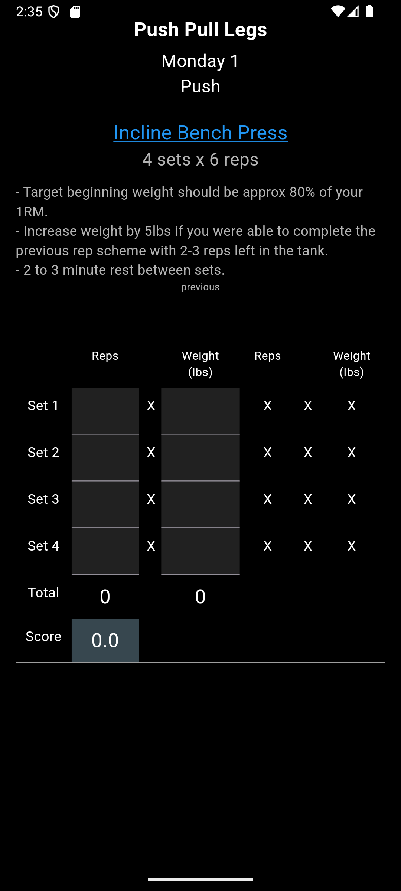

# The Lift League

Lift League is a Flutter-based strength training and workout tracking app. It lets users log lifts, join leagues, and monitor progress while keeping workouts in sync across devices through Firebase.

## Build prerequisites

- **Flutter**: 3.29.3
- **Dart**: 3.6.1
- Optional: **Node.js 22** if you intend to build Firebase Cloud Functions.

### Setup

1. Install Flutter and Dart using the versions above.
2. Clone this repository and run `flutter pub get` to fetch packages.
3. Configure your Firebase project if you plan to enable push notifications and analytics.
4. Build and run the app with `flutter run`.

## Contributing

We welcome contributions! To get started:

1. Fork the repo and create a topic branch.
2. Follow the lints defined in `analysis_options.yaml` and format your code using `flutter format .`.
3. Test your changes locally with `flutter run` or `flutter build`.
4. Open a pull request describing your changes and why they improve the project.

